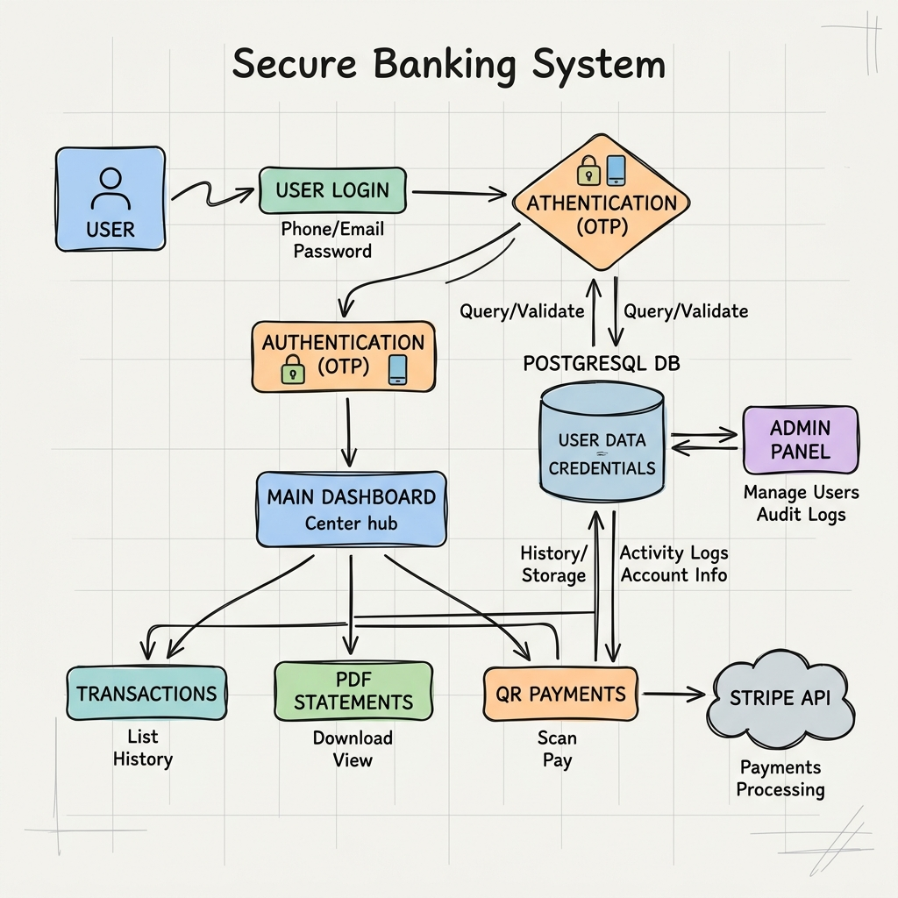

<div align="center">


# 🌌 SkyBanking: Enterprise-Grade Financial Ecosystem

**Secure | Scalable | Seamless**


</div>

---

## 🏛️ Project Overview

**SkyBanking** is a secure and scalable banking web application built using a modern Java-based backend with PostgreSQL database support. It provides digital banking features such as user registration, login, account management, deposits, withdrawals, peer-to-peer transfers, QR-based payments, PDF reports, and administrator-level monitoring.

The system focuses on clean architecture, secure transaction handling, role-based access, database consistency, and production-ready deployment.

---

## 📊 System Architecture & Flow

<div align="center">



</div>

---

## 🚀 Core Features

### 💎 User Features

- Secure user registration and login
- OTP-based verification flow
- Account balance management
- Deposit and withdrawal support
- Peer-to-peer money transfer
- QR code-based payment system
- Transaction history tracking
- PDF account statements and invoices
- Profile and account information management

### 🛡️ Admin Features

- Admin login and secure dashboard
- User account monitoring
- Transaction activity overview
- OTP and security audit tracking
- Banking configuration management
- Tax, limit, and interest-related controls
- User lifecycle management

---

## 🛠️ Tech Stack

| Layer | Technology |
|---|---|
| Backend | Java 21, Servlets, JSP |
| Database | PostgreSQL |
| Build Tool | Maven |
| Payment Gateway | Stripe |
| Security | BCrypt, OTP, Session Handling |
| Reports | PDF Generation |
| Deployment | Apache Tomcat / Render |
| Version Control | Git & GitHub |

---

## 📁 Project Structure

```text
src/main/java/com/skybanking/
├── model/        # Data models and entity classes
├── util/         # Utility services, validation, PDF, tax, security
├── web/          # User-side servlet controllers
└── admin/        # Admin-side servlet controllers
````

---

## 🛠️ Installation & Rapid Deployment

### 1. Clone the Repository

```bash
git clone <your-repository-url>
cd SkyBanking
```

---

### 2. Database Initialization

Create the database:

```sql
CREATE DATABASE skybank;
```

Import the PostgreSQL schema:

```bash
psql -U postgres -d skybank -f database/skybanking_schema_pg.sql
```

---

### 3. Environment Configuration

Create a `.env` file in the root directory using `.env.example` as reference.

```env
DB_URL=jdbc:postgresql://localhost:5432/skybank
DB_USER=postgres
DB_PASSWORD=your_secure_password

STRIPE_SECRET_KEY=sk_test_your_key_here
SMTP_PASSWORD=your_app_password
```

> Never commit the `.env` file to GitHub.

---

### 4. Build the Project

```bash
mvn clean package
```

---

### 5. Deploy on Tomcat

Copy the generated WAR file:

```text
target/BankingWebApp.war
```

Paste it inside the Tomcat `webapps` directory.

Start Tomcat:

```bash
bin/startup.bat
```

---

## 🌐 Application URLs

### Local Deployment

```text
User Portal:
http://localhost:9090/BankingWebApp/

Admin Portal:
http://localhost:9090/BankingWebApp/admin/
```

### Live Deployment

```text
User Login:
https://skybanking.onrender.com/login

Admin Login:
https://skybanking.onrender.com/admin/login
```

---

## 🗄️ Database Hosting Note

If the database is hosted on Supabase and it gets paused due to inactivity, start it manually from the Supabase dashboard:

```text
https://supabase.com/dashboard/project/
```

---

## 🔐 Security Hardening

SkyBanking follows essential security practices required for public deployment:

* Passwords stored using BCrypt hashing
* Sensitive credentials loaded from environment variables
* No hardcoded database passwords or secret keys
* Secure session-based authentication
* Input validation on critical forms
* SQL injection protection using prepared statements
* Transaction safety using ACID-compliant database operations
* Safe payment verification using Stripe integration
* Audit logs for important system activities

---

## 🔮 Future Roadmap

* [ ] Android and iOS mobile application
* [ ] Multi-currency banking support
* [ ] AI-powered fraud detection
* [ ] Docker-based deployment
* [ ] Kubernetes scaling support
* [ ] Advanced analytics dashboard
* [ ] Email and SMS alert system

---

## 👨‍💻 Developer

<div align="center">

Developed with ❤️ by the **SkyBanking Team**

</div>
